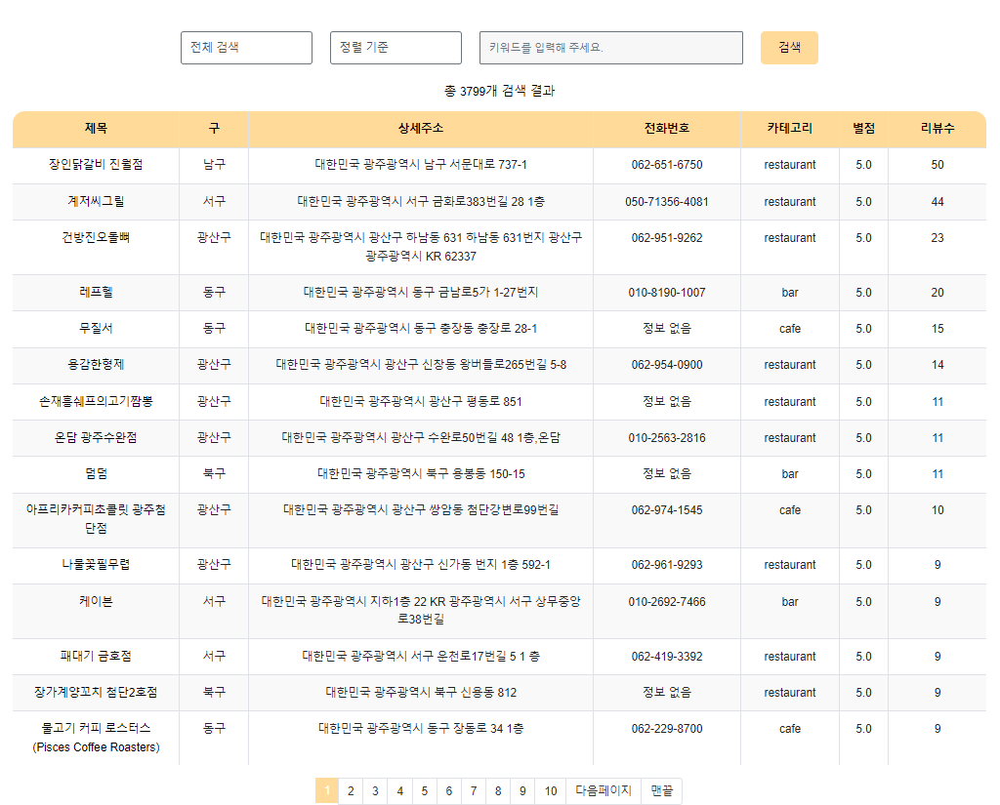
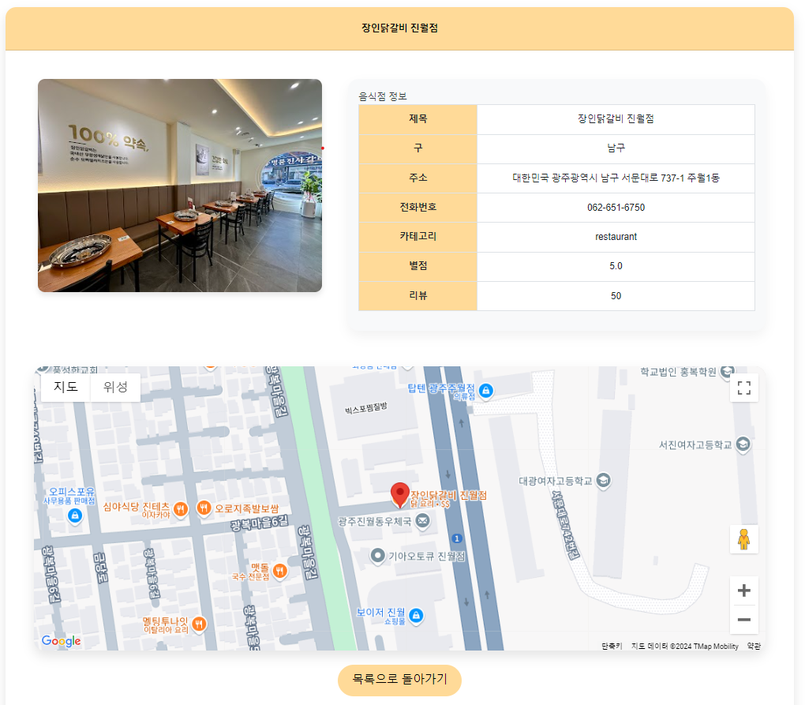

# TeamProject - レストラン検索および詳細情報システム

  

このプロジェクトは、レストランのリストと詳細情報を提供する**ウェブアプリケーション**です。

ユーザーはレストランを検索し、Google Maps API を通じて位置情報を視覚的に確認することができます。このアプリケーションは、チームプロジェクトの一環として開発されました。

  

-  **チーム長のGitHubレポジトリ（全体コードの閲覧）:** [JuYoungJun / TeamProject](https://github.com/JuYoungJun/TeamProject)

  

---

  

## 目次

  

- [プロジェクト概要](#プロジェクト概要)

- [貢献内容](#貢献内容)

- [機能](#機能)

- [技術スタック](#技術スタック)

- [プロジェクト構造](#プロジェクト構造)

- [データベーステーブル](#データベーステーブル)

- [実行方法](#実行方法)

- [環境変数](#環境変数)

- [スクリーンショット](#スクリーンショット)

- [貢献方法](#貢献方法)

- [ライセンス](#ライセンス)

  

---

  

## プロジェクト概要

  

このプロジェクトの目的は、ユーザーがレストランを**エリアとキーワード**で検索し、**レビュー数と評価**に基づいて並べ替えた結果を提供することです。

ユーザーは詳細ページでレストランの情報を確認し、その位置をGoogle Mapsを使って視覚的に確認することができます。

  

---

  

## 貢献内容

  

私は以下の主要な機能とコードの実装に貢献しました。

  

1.  **`FoodListController.java`**

- レストランのリストおよび詳細情報を提供するためのコントローラを実装

-  `GET /foodlist`リクエストを処理し、検索されたレストランデータを返します

- 特定のレストランの詳細情報を取得するエンドポイントを実装

  

2.  **`FoodService.java`**

- レストラン関連のビジネスロジックを実装

- リストと詳細情報を取得するサービスメソッドを提供

  

3.  **`FoodMapper.java` および `foodMapper.xml`**

- MyBatisのマッパーインターフェースとSQLクエリの作成

- レストランのリストと詳細情報の取得、並べ替えのためのSQLを実装

  

4.  **`foodList.html`**

- Bootstrapを使用したUIの実装によるレストランリストページの作成

- エリア選択とキーワード検索、並べ替えおよびページネーション機能を提供

  

5.  **`foodDetail.html`**

- 詳細情報ページを実装し、Google Maps APIを使用して位置情報を視覚化

  

---

  

## 機能

  

-  **レストランリスト検索:** エリアとキーワードを選択してレストランリストを検索

-  **並べ替え:** レビュー数と評価順でレストランを並べ替え

-  **詳細情報の表示:** 詳細ページでレストランの情報と位置を表示

-  **ページネーション:** 検索結果をページ単位で表示

  

---

  

## 技術スタック

  

-  **バックエンド:** Java, Spring Boot, MyBatis

-  **フロントエンド:** Thymeleaf, HTML5, CSS3, Bootstrap 4.5, jQuery

-  **データベース:** MySQL

-  **API:** Google Maps API

  

---

  

## プロジェクト構造

  

```bash

src/

├──  main/

│  ├──  java/

│  │  └──  yohaeng/

│  │  └──  gwangju/

│  │  ├──  controller/

│  │  │  └──  FoodListController.java  # レストランリストと詳細情報を提供

│  │  ├──  service/

│  │  │  └──  FoodService.java  # レストラン関連ビジネスロジック

│  │  ├──  mapper/

│  │  │  └──  FoodMapper.java  # MyBatisマッパーインターフェース

│  ├──  resources/

│  ├──  mybatis/

│  │  └──  foodMapper.xml  # レストラン関連SQLクエリ

│  └──  templates/

│  ├──  foodList.html  # レストランリストページ

│  └──  foodDetail.html  # レストラン詳細ページ

```

  

---

  

## データベーステーブル

  

### `food` テーブル構造

  

```sql

CREATE  TABLE `food` (

`id`  INT  PRIMARY KEY  NOT NULL AUTO_INCREMENT, -- 投稿番号

`title`  VARCHAR(100) NOT NULL, -- レストラン名

`addr1`  VARCHAR(100) DEFAULT  NULL, -- 住所

`addr2`  VARCHAR(10) DEFAULT  NULL, -- 行政区

`image`  VARCHAR(1000) DEFAULT  NULL, -- レストラン画像

`tel`  VARCHAR(30) DEFAULT  NULL, -- 電話番号

`rating` DOUBLE DEFAULT  NULL, -- 評価

`review_cnt`  INT  DEFAULT  NULL, -- レビュー数

`cat1`  VARCHAR(30) DEFAULT  NULL, -- 大分類カテゴリコード

`cat2`  VARCHAR(30) DEFAULT  NULL, -- 中分類カテゴリコード

`cat3`  VARCHAR(30) DEFAULT  NULL, -- 小分類カテゴリコード

`mapx` DOUBLE DEFAULT  NULL, -- 地図上のX座標

`mapy` DOUBLE DEFAULT  NULL, -- 地図上のY座標

`sigungucode`  INT  DEFAULT  NULL, -- 区コード (例: 光山区: 1)

`category`  INT  DEFAULT  NULL  -- 投稿の種類 (例: 12は観光地)

);

```

  

**注意:**  `cat1`, `cat2`, `cat3`は大分類、中分類、小分類のために設計されましたが、時間の制約により**大分類(cat1)**のみが使用されています。

  

---

  

## 実行方法

  

1.  **依存関係のインストール:**

Gradleコマンドで依存関係をインストールします。

  

```bash

./gradlew build

```

  

2.  **アプリケーションの起動:**

プロジェクトを起動します。

  

```bash

./gradlew bootRun

```

  

3.  **アクセス:**

ブラウザで [http://localhost:8080/foodlist](http://localhost:8080/foodlist) にアクセスします。

  

---

  

## 環境変数

  

-  **Google Maps APIキー:**

`application.properties`ファイルで以下のようにAPIキーを設定します。

  

```

google.maps.api.key=YOUR_API_KEY

```

  

---

  

## スクリーンショット

  

### レストランリストページ



  

### レストラン詳細情報ページ



  

---

  
